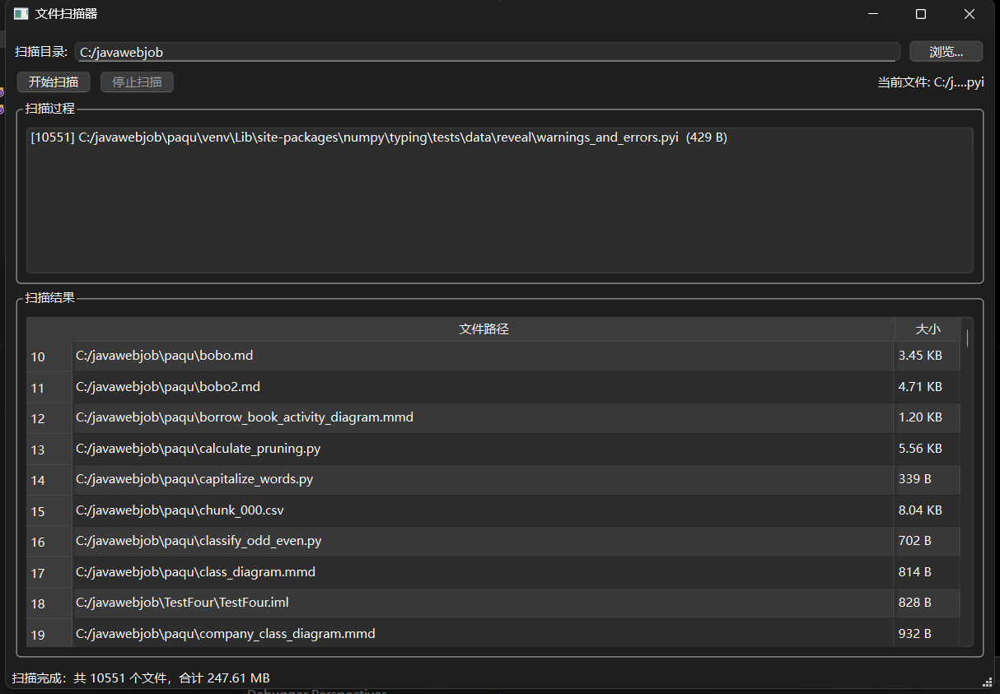
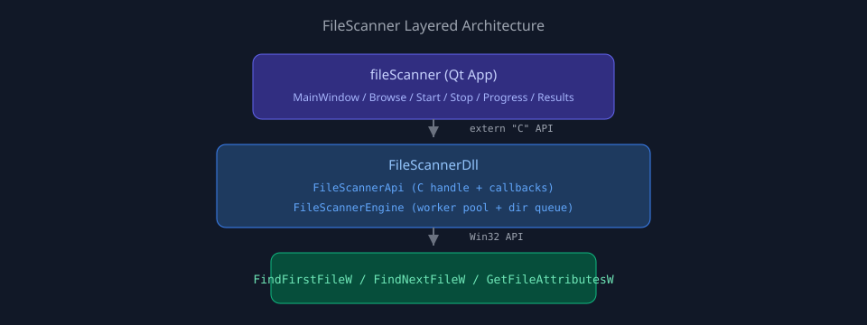

## 写在前面

在桌面开发面试和实际项目中，「**扫描一个目录下所有文件，实时显示进度，支持随时取消**」是一个看似简单、实则考察面极广的需求。它同时涉及：

- 多线程并发与任务调度
- 跨语言 DLL 接口设计
- Win32 文件系统 API
- Qt 跨线程 UI 更新
- 生命周期管理与死锁规避

**FileScanner** 是我针对这类场景实现的一个完整解决方案：核心逻辑封装在独立的 `FileScannerDll` 中，Qt 演示程序只负责 UI 展示。整个项目约 800 行有效代码，但覆盖了 C++ 桌面开发的多个核心知识点。



## 项目定位

| 维度 | 说明 |
|------|------|
| **目标平台** | Windows（宽字符路径 `wchar_t`） |
| **核心能力** | 多线程递归扫描、实时进度回调、随时取消、批量结果读取 |
| **架构模式** | 核心 DLL + Qt 演示 UI，引擎层零 Qt 依赖 |
| **适用场景** | 磁盘空间分析、批量文件导入、目录监控的前置扫描 |

与 [Smart Vision Workbench](/posts/project-smart-vision-workbench/) 这类应用层项目不同，FileScanner 更偏向**底层工程能力**——如何把 I/O 密集任务从 UI 线程剥离，如何设计稳定的 C API，如何在多 worker 并发下正确判断「扫描完成」。

## 技术栈

- **语言**：C++17
- **UI 框架**：Qt 6.8 Widgets（仅演示层）
- **系统 API**：Win32 `FindFirstFileW` / `FindNextFileW`
- **并发原语**：`std::thread`、`std::mutex`、`std::atomic`、`std::condition_variable`
- **构建**：CMake 3.16+，MinGW / MSVC 均可

一个关键设计决策：**扫描引擎完全不依赖 Qt**。这意味着同一个 DLL 可以被 C#、Python ctypes、Electron Native Module 等任意宿主调用，Qt 程序只是众多消费者之一。

## 整体架构



```
┌─────────────────────────────────────────┐
│  fileScanner（Qt 可执行程序）              │
│  MainWindow — 路径选择、进度列表、结果表格  │
└─────────────────┬───────────────────────┘
                  │ extern "C" API
                  │ Create / Start / Cancel / GetResults
┌─────────────────▼───────────────────────┐
│  FileScannerDll（共享库）                  │
│  FileScannerApi    — C 接口封装 + 句柄     │
│  FileScannerEngine — 多线程扫描引擎        │
└─────────────────┬───────────────────────┘
                  │ Win32 API
┌─────────────────▼───────────────────────┐
│  FindFirstFileW / GetFileAttributesW     │
└─────────────────────────────────────────┘
```

这种分层带来三个实际好处：

1. **ABI 稳定**：对外暴露纯 C 函数，无 C++ 名字修饰，跨编译器调用无障碍
2. **职责清晰**：引擎只管扫描，UI 只管展示，测试时可以脱离 Qt 单独验证 DLL
3. **可替换 UI**：未来换成 WPF、命令行工具或 Web 后端，核心逻辑无需重写

## 核心设计一：C API 与 opaque handle

DLL 对外只暴露一组 C 函数和一个不透明句柄 `FileScannerHandle`（实际指向内部的 `ScannerInstance`）。接口设计如下：

```cpp
typedef void* FileScannerHandle;

typedef void (*FileScanProgressFn)(const wchar_t* path, std::int64_t size, void* userData);
typedef void (*FileScanFinishedFn)(int fileCount, std::int64_t totalSize, int cancelled, void* userData);

FileScannerHandle FileScanner_Create(void);
int  FileScanner_Start(FileScannerHandle, const wchar_t* rootPath,
                       FileScanProgressFn, FileScanFinishedFn, void* userData);
void FileScanner_Cancel(FileScannerHandle);
int  FileScanner_GetResults(FileScannerHandle, wchar_t* pathBuffer,
                            std::int64_t* sizeBuffer, int count, int pathCharCapacity);
```

几个值得展开的细节：

**为什么用 `extern "C"`？** C++ 编译器会对函数名做 name mangling（如 `?StartScan@@YAXXZ`），不同编译器、不同版本的 mangling 规则不一致。`extern "C"` 保证导出符号就是函数名本身，C# 的 `DllImport`、Python 的 `ctypes.CDLL` 都能直接绑定。

**为什么用 `void*` 句柄而不是暴露 C++ 类？** 这是经典的 Pimpl / opaque pointer 模式。调用方不知道内部是 `FileScannerEngine` 还是别的实现，DLL 可以自由升级内部逻辑而不破坏 ABI。同时避免了「调用方和 DLL 使用不同 CRT 版本时 `delete` 崩溃」的经典陷阱。

**为什么 `GetResults` 要求调用方预分配缓冲区？** C 接口无法安全地暴露 `std::vector<std::wstring>`。预分配连续内存是 Win32 世界里的惯用做法——路径缓冲区按「每条路径占 `pathCharCapacity` 个 `wchar_t`」排列，大小数组与之平行索引。UI 层使用 32768 的容量，约 64KB，足够容纳 Windows 最长路径。

## 核心设计二：并行目录遍历


### 为什么不用单线程递归？

单线程深度优先递归是最直觉的实现，但在大规模目录（数十万文件、深层嵌套）下有两个问题：

1. **无法利用多核**：现代 CPU 有 8~16 个逻辑核心，单线程扫描只占用一个
2. **栈深度风险**：极深目录结构可能导致栈溢出

FileScanner 采用的是**队列驱动的并行 BFS**——多个 worker 线程共享一个 `dirQueue_`，谁空闲谁取任务：

```
1. 根目录入队，pendingDirectories_ = 1
2. 启动 N 个 worker（N = max(2, CPU 核心数)）
3. worker 从队列取目录 → FindFirstFileW 枚举
4. 遇到文件 → 记录 + 进度回调
   遇到子目录 → 入队 + pendingDirectories_++
5. 当前目录扫完 → pendingDirectories_--
6. 减到 0 → 触发完成回调
```

worker 主循环的核心逻辑：

```cpp
void FileScannerEngine::workerLoop()
{
    while (true) {
        if (cancelRequested_.load(std::memory_order_acquire))
            break;

        std::wstring directory;
        if (!tryPopDirectory(directory))
            break;

        scanDirectory(directory);

        // fetch_sub 返回减之前的值；若为 1，说明这是最后一个目录
        if (pendingDirectories_.fetch_sub(1, std::memory_order_acq_rel) == 1) {
            maybeFinish(cancelRequested_.load(std::memory_order_acquire));
        }
    }
    workerExit();
}
```

### pendingDirectories_：完成检测的关键

这是整个引擎里最有「工程设计感」的部分。初学者容易犯的错误是：**队列空了就算扫描完成**。实际上队列空只意味着「当前没有待取的任务」，不代表扫描结束——可能还有 worker 正在扫描一个大目录，尚未将其子目录 push 进队列。

`pendingDirectories_` 计数器解决了这个问题：

| 事件 | 操作 |
|------|------|
| 发现新子目录并入队 | `fetch_add(1)` |
| 一个目录扫描完毕 | `fetch_sub(1)` |
| 值变为 0 | 所有目录都已处理，可以 finish |

配合 `condition_variable`，worker 在队列空但 `pendingDirectories_ > 0` 时会阻塞等待，直到有新目录入队或被取消：

```cpp
queueCv_.wait(lock, [this] {
    return !dirQueue_.empty()
        || pendingDirectories_.load(std::memory_order_acquire) == 0
        || cancelRequested_.load(std::memory_order_acquire);
});
```

### 线程安全策略

| 共享资源 | 保护方式 | 原因 |
|----------|----------|------|
| `summary_`（结果 vector） | `stateMutex_` | 多 worker 同时 push_back |
| `dirQueue_` | `queueMutex_` + `condition_variable` | 生产者-消费者模型 |
| `cancelRequested_`、`pendingDirectories_` | `std::atomic` | 高频读写，避免锁竞争 |
| UI 控件 | 主线程 `QTimer` 批量刷新 | Qt 线程亲和性规则，避免事件队列堆积 |

## 核心设计三：取消与生命周期

用户点击「停止扫描」后，引擎需要在**合理时间内**响应，且不能留下僵尸线程或重复触发完成回调。

### 取消流程

1. `cancelRequested_` 置为 `true`（`memory_order_release`）
2. `queueCv_.notify_all()` 唤醒所有阻塞在空队列上的 worker
3. worker 在循环入口、`FindNextFileW` 迭代间持续检查取消标志
4. 所有 worker 退出后，由最后一个退出的线程触发 `maybeFinish(true)`

### 完成回调只触发一次

正常完成和取消完成可能由不同线程触发，`finishNotified_` 用 CAS 保证幂等：

```cpp
void FileScannerEngine::maybeFinish(bool cancelled)
{
    bool expected = false;
    if (!finishNotified_.compare_exchange_strong(expected, true, std::memory_order_acq_rel))
        return;
    finishScan(cancelled);
}
```

### 一个经典的死锁陷阱

`finishScan` **不能** join 工作线程。原因很简单——`finishScan` 本身可能就是某个 worker 调用的，线程 join 自己必然死锁：

```cpp
// 注意：不能在这里 join 工作线程！
// 因为 finishScan 可能就是某个工作线程调用的，join 自己会死锁。
```

正确的做法是：线程在下次 `Start` 或引擎析构时再 join。析构函数中先 `cancel()` 再逐个 `join()`，确保对象销毁时没有悬空线程。

## 核心设计四：Qt 跨线程 UI 更新

DLL 的进度回调从 worker 线程触发，而 Qt 规定**所有 UI 操作必须在主线程执行**。直接在回调里 `listWidget->addItem()` 会导致随机崩溃。

最初我用 `QMetaObject::invokeMethod` + `Qt::QueuedConnection`，每发现一个文件就投递一条 UI 事件。这在 Maven 仓库、解压目录等**文件量极大的场景**下会出问题：主线程事件队列被瞬间塞满，界面表现为「扫描卡住、按钮点不动」——扫描线程其实还在跑，只是 UI 来不及刷新。

最终方案是**生产者-消费者分离**：

```cpp
void MainWindow::progressCallback(const wchar_t* path, std::int64_t size, void* userData)
{
    auto* window = static_cast<MainWindow*>(userData);
    {
        std::lock_guard<std::mutex> lock(window->progressMutex_);
        window->latestPath_ = QString::fromWCharArray(path);
        window->latestSize_ = static_cast<qint64>(size);
    }
    window->discoveredCount_.fetch_add(1, std::memory_order_relaxed);
}
```

工作线程只更新原子计数和最新路径；主线程用 `QTimer`（100ms 间隔）批量刷新界面：

- 状态栏显示「已发现 N 个文件...」
- 「当前文件」标签显示最新路径（过长时中间省略）
- 进度列表保留最近 200 条采样记录，避免列表控件自身拖慢 UI

扫描完成仍通过 `invokeMethod` 投递 `onScanFinished`，结果表格在扫描结束后通过 `FileScanner_GetResults` 一次性批量读取——这是「实时反馈」与「最终展示」的职责分离。

这个改动的关键点是：**DLL 仍然每个文件都回调一次**（满足接口契约），UI 如何消费回调是调用方的职责。高频回调直接刷界面是 Qt 多线程开发里的经典踩坑。

## Win32 API 的选择

为什么底层用 `FindFirstFileW` 而不是 Qt 的 `QDir::entryList`？

| 对比 | Win32 API | Qt QDir |
|------|-----------|---------|
| DLL 依赖 | 零额外依赖 | 需要链接 QtCore |
| 性能 | 直接系统调用 | 多一层封装 |
| 跨语言 | 任何 Win32 宿主可用 | 仅限 Qt 项目 |
| 路径编码 | 原生 UTF-16 | QString 内部也是 UTF-16，但多一次转换 |

对于一个刻意与 Qt 解耦的引擎来说，Win32 是更自然的选择。文件大小的处理也体现了 Win32 的「历史包袱」——64 位大小被拆成两个 32 位整数：

```cpp
std::int64_t combineFileSize(unsigned long low, unsigned long high)
{
    ULARGE_INTEGER size{};
    size.LowPart = low;
    size.HighPart = high;
    return static_cast<std::int64_t>(size.QuadPart);
}
```

## 构建与项目结构

CMake 定义两个 target：`FileScannerDll`（SHARED）和 `fileScanner`（Qt 可执行文件）。关键配置：

```cmake
add_library(FileScannerDll SHARED ${SCANNER_SOURCES})
target_compile_definitions(FileScannerDll PRIVATE FILESCANNER_EXPORTS)

qt_add_executable(fileScanner ${APP_SOURCES})
target_link_libraries(fileScanner PRIVATE FileScannerDll Qt6::Widgets)
```

源码组织：

```
fileScanner/
├── CMakeLists.txt
├── main.cpp
├── mainwindow.h / .cpp / .ui
└── scanner/
    ├── FileScannerApi.h / .cpp      # C 导出接口
    ├── FileScannerEngine.h / .cpp   # 多线程引擎
    └── FileScannerTypes.h           # 内部数据结构
```

## 已知局限与改进方向

诚实地说，当前版本是一个**工程练习级别的实现**，离生产环境还有距离：

| 局限 | 影响 | 改进思路 |
|------|------|----------|
| 全量内存存储 | 百万级文件可能 OOM | 流式写入 SQLite / 内存映射文件 |
| 进度列表为采样显示 | 中间文件不会逐条出现在列表 | 虚拟列表或按需导出日志 |
| 未处理符号链接 | 可能重复计数或死循环 | 检测 `FILE_ATTRIBUTE_REPARSE_POINT` |
| 未处理权限拒绝 | 静默跳过，无错误汇总 | 收集 `GetLastError` 并回调通知 |
| 线程数不可配置 | 机械硬盘上过多线程反而慢 | 暴露 `workerCount` 参数 |
| 无单元测试 | 重构风险高 | 对 Engine 做 gtest 覆盖 |

这些局限本身也是很好的学习材料——从「能跑」到「能上线」，每一层都有具体的工程决策要做。

## 亮点总结

| 亮点 | 说明 |
|------|------|
| **DLL 与 UI 解耦** | 引擎零 Qt 依赖，C API 可被任意语言调用 |
| **并行 BFS 扫描** | 队列 + worker 池，充分利用多核 I/O |
| **pendingDirectories_ 计数** | 精确判断扫描完成，避免「队列空 ≠ 任务完」的陷阱 |
| **CAS 幂等 finish** | 多路径触发下完成回调只执行一次 |
| **死锁规避** | finishScan 不 join 自身线程，析构时统一回收 |
| **QTimer 节流刷新** | 高频 progress 回调不阻塞主线程事件队列 |

## 总结

FileScanner 是一个「小而深」的 C++ 桌面工程项目。代码量不大，但几乎每一行都对应一个真实的工程问题：怎么并行遍历目录、怎么设计稳定的 DLL 接口、怎么在 worker 线程和 UI 线程之间安全传递数据、怎么取消一个正在进行的多线程任务。

如果你正在准备 Qt/C++ 桌面开发的面试，或者想理解「为什么我的扫描器一取消就崩溃 / 一扫描 UI 就卡死」，这个项目里的设计取舍和踩坑注释应该能给你一些参考。

---

> 项目源码：本地仓库 `fileScanner`（Qt 6 + CMake）
>
> 相关阅读：[Smart Vision Workbench 项目展示](/posts/project-smart-vision-workbench/) · [深入理解 Qt 核心机制](/posts/qt-core-mechanisms/)
